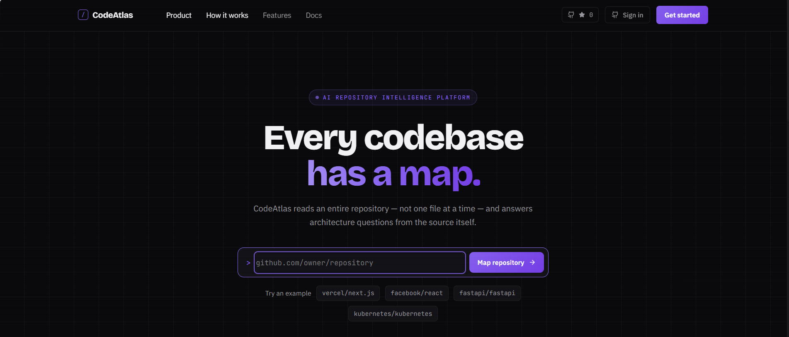
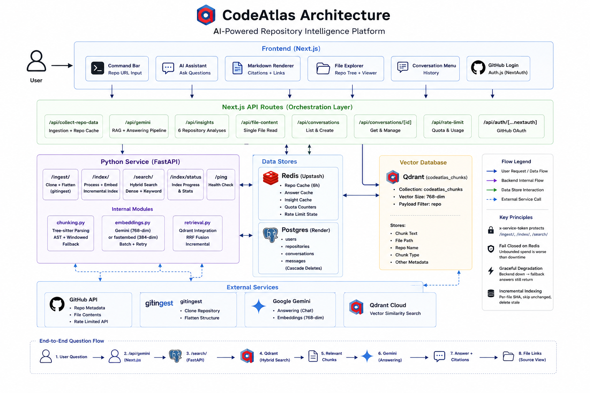

<div align="center">
  

  <h1>CodeAtlas</h1>

  <p><strong>An AI-powered Repository Intelligence Platform.</strong><br/>
  Read a whole codebase the way you'd read a map — not one file at a time.</p>

  <p>
    
    
    
    
    
    
  </p>
</div>

---

## The problem

Dropping into an unfamiliar repository is archaeology. You open files semi-randomly, guess at module boundaries from directory names, and rebuild the author's intent from identifiers. The understanding you assemble is expensive, private, and gone the moment you switch projects.

Most AI coding tools make this worse, not better. They answer one file at a time, so the questions that actually matter — *how does this fit together, what breaks if I change this, why is it built this way* — are exactly the ones they answer worst.

## The approach

CodeAtlas ingests the **entire** repository in one pass — source, tree, documentation — parses it with tree-sitter so retrieval units are whole functions rather than arbitrary character windows, and answers against what it retrieves.

```
  repository ──▶ ingest ──▶ chunk ──▶ embed ──▶ retrieve ──▶ answer
                 (whole)    (AST)    (vector)   (hybrid)   (grounded)
```

Three properties follow:

- **Grounded, not recalled.** Answers derive from the code in front of us, not from what projects like this usually look like. Every answer reports whether retrieval was used, and cites paths you can open.
- **Whole-system by default.** The unit of understanding is the repository, not the file.
- **Degrades instead of failing.** Vector store unavailable → falls back to whole-repository context. Database absent → conversations stop persisting, everything else works. Retrieval improves answers; it is never the reason there is no answer.

> [!NOTE]
> **Early and honest.** [`docs/ENGINEERING_NOTEBOOK.md`](docs/ENGINEERING_NOTEBOOK.md) is the source of truth for design, decisions and **six open limitations** — including measurements of where this doesn't work well yet. Read it before contributing.

---

## What's in the box

| | |
|---|---|
| **Whole-repository ingestion** | Full tree and contents in one pass, size-gated before spending, cached 6h |
| **AST-aware chunking** | tree-sitter across 15 languages; one chunk per top-level definition, windowed fallback for prose |
| **Hybrid retrieval** | Dense vector search + keyword matching, fused with Reciprocal Rank Fusion (k=60) |
| **Incremental indexing** | Per-file SHA — unchanged files are never re-embedded, stale vectors are deleted |
| **Grounded assistant** | Cites real paths that resolve to the viewer; renders mermaid for architecture questions |
| **Six repository analyses** | Architecture, Modules, API surface, Dependencies, Onboarding, Insights |
| **Three-pane workspace** | Resizable explorer / viewer / assistant; code, notebooks and PDFs render in place |
| **Tiered quota** | 20/day anonymous, 100/day signed in — atomic in Redis, **fails closed** |
| **Saved conversations** | Postgres-backed, per user, with ownership enforced in-query (optional) |
| **Answer + repo caching** | A repeated question costs no model call and no quota |
| **Request correlation** | One request id on every response body, header and log line |
| **Evaluated retrieval** | recall@k and MRR over a labelled fixture, run in CI on every push |

---

## Architecture

<div align="center">
  
</div>

**Two services, three stores, one external vector database.**

The Python service is separate because the work is Python-shaped: `tree-sitter`, the Qdrant client and the embedding libraries are all first-class there, and parsing is CPU-bound. The Next.js side owns orchestration — quota, caching, prompt budget, persistence — and never talks to Qdrant directly.

Boundaries worth knowing:

- `/ingest/`, `/index/` and `/search/` spend money, so they sit behind an `x-service-token` shared secret. That is defence-in-depth locally, where nothing is published, and the *only* control once the backend has a public URL.
- The quota **fails closed**. If Redis is unreachable, requests are refused with `503 quota_unavailable` rather than run without an enforceable ceiling — unbounded spend in front of a paid API is worse than downtime.
- Answer caching is deliberately conservative: follow-ups and file-scoped questions are excluded, because a confidently wrong cached answer is a worse trade than the call it saves.

Full detail — request sequences, retrieval design, and every decision with its tradeoff — is in the [engineering notebook](docs/ENGINEERING_NOTEBOOK.md#3-current-architecture).

---

## Quickstart

**You'll need:** Node 20+ with pnpm · Python 3.10+ · a Redis instance · a [Gemini API key](https://aistudio.google.com/app/apikey) · a GitHub PAT (**classic, no scopes ticked** — CodeAtlas only reads public repos, so the token is purely for the higher rate limit).

```bash
# 1 — install
cd frontend && pnpm install && cd ..
pip install -r backend/requirements.txt

# 2 — configure (repo root; one file shared by both services)
cp .env.example .env           # then fill in the values

# 3 — run both services
uvicorn main:app --reload --port 8000 --app-dir backend   # terminal 1
cd frontend && pnpm dev                                    # terminal 2
```

Open `http://localhost:3001`, paste a repository, and the workspace opens at `/{owner}/{name}`.

Retrieval is optional for a first run — without Qdrant the app falls back to whole-repository context and still answers. To enable it: `docker run -d -p 6333:6333 qdrant/qdrant`.

<details>
<summary><strong>Docker (full stack)</strong></summary>

```bash
cd docker
docker compose --env-file ../.env up --build
```

Six containers: the web app, the ingestion/retrieval backend, Redis, Qdrant, Postgres, and a one-shot `migrate` service that applies `database/migrations` and exits **before** the web app starts. Only the web app is published — on **`http://localhost:3000`**, not 3001; `pnpm dev` uses 3001 so the two can run side by side.

Sign-in does not work against the Docker stack unless your OAuth app's callback is registered for port 3000 — see §20 of the engineering notebook.
</details>

<details>
<summary><strong>Deploying</strong></summary>

`render.yaml` is a Render Blueprint declaring the web app (Docker), the FastAPI service, Postgres and a Key Value store. Qdrant is external by necessity — Render has no managed vector database — so `QDRANT_URL` points at a Qdrant Cloud cluster.

Migrations are **not** run automatically. Apply them by hand before the first deploy, and before any version that depends on a schema change:

```bash
cd frontend
DATABASE_URL='<external-connection-string>?sslmode=require' pnpm db:migrate
```

`sslmode=require` is mandatory — Render Postgres refuses plaintext connections, and drizzle-kit's progress spinner swallows the resulting error. §20 of the notebook has the full procedure, the required/optional variable split, and the free-tier caveats (services sleep after 15 minutes idle; free Postgres expires 30 days after creation).
</details>

---

## Configuration

Every setting is an environment variable. `.env.example` documents all of them; these are the ones without which nothing runs:

| Variable | Purpose |
|---|---|
| `GEMINI_API_KEY` | Answering model and embeddings |
| `GITHUB_TOKEN` | Repository metadata and file reads |
| `GITINGEST_API_URL` | Where the ingestion service lives (compose sets this itself) |
| `REDIS_URL` | Repository cache **and** quota store (compose sets this itself) |
| `NEXT_PUBLIC_APP_URL` | This deployment's public base URL |

**Deploying beyond a laptop** needs three more: `INGEST_SERVICE_TOKEN` (without it the backend's paid endpoints are unauthenticated), `AUTH_SECRET` (whenever sign-in is configured), and `POSTGRES_PASSWORD` (it defaults to `codeatlas`).

**Optional, and off cleanly when unset:** `QDRANT_URL` (retrieval) · `DATABASE_URL` (saved conversations) · `AUTH_GITHUB_ID`/`_SECRET` (sign-in) · `GEMINI_API_KEY_SECONDARY` (failover) · `EMBEDDING_PROVIDER=local` (no-quota CPU embeddings via fastembed) · `TRUSTED_PROXY_HOPS` (set to 1 behind a load balancer, or every anonymous caller shares one quota bucket).

No identifier is hardcoded anywhere — leave a variable unset and its feature switches off cleanly.

---

## Asking good questions

The assistant is scoped to the open repository. It rewards architectural questions:

```
Explain the project structure and what it does
Draw the request flow as a sequence diagram
What are the main dependencies, and why is each one here?
Which files would I need to touch to add X?
Explain this file            ← with a file selected in the explorer
```

Quick-prompt buttons cover the common ones. The first is context-aware: it becomes *Explain this file* whenever a file is open.

---

## Tests

```bash
cd frontend && pnpm test                              # 115 unit tests
cd frontend && VITEST_INTEGRATION=true pnpm test      # 11, needs a real Postgres
cd backend  && python -m pytest -q                    # 33 unit tests
cd backend  && python -m eval.run_eval                # retrieval recall@k + MRR
```

No test makes a paid API call or needs a running service — except the integration suite (real Postgres, also run in CI against a service container) and the opt-in answer-quality eval, which is **billable** and excluded from CI by design.

CI additionally builds all three Docker images and asserts the web image **starts and serves a request**. Two production blockers once reached `main` having passed every other gate.

---

## Layout

```
frontend/           Next.js web application
  app/              App Router — pages and API route handlers
  components/       Workspace panes, viewers, site sections, shadcn/ui primitives
  lib/              GitHub client, prompt assembly, caching, quota, auth, persistence
  eval/             Answer-quality harness (billable, opt-in)
backend/            FastAPI ingestion + retrieval service
  chunking.py       tree-sitter parsing and chunk boundaries
  embeddings.py     Gemini or local fastembed, behind one interface
  retrieval.py      Qdrant, hybrid search, RRF fusion, incremental indexing
  eval/             Retrieval-quality harness (runs in CI)
database/           Checked-in SQL migrations
docker/             Dockerfiles + compose stack
docs/               Engineering notebook — start here
render.yaml         Render Blueprint
.env                Shared configuration for both services
```

---

## Known limitations

Measured, not guessed — the notebook carries the evidence for each:

- **The keyword arm rarely fires on natural language.** Qdrant's `MatchText` requires every query token to appear in a chunk, so a full sentence matches nothing and retrieval is effectively dense-only for typical questions. Identifier lookups do use both arms.
- **AST chunking only reaches top-level definitions.** A module wrapped in an IIFE, or a single large class, degrades to windowed chunks — silently.
- **Structured logging, not observability.** Request-id correlation exists; metrics, traces and error reporting do not.
- **Public repositories only.** OAuth requests `read:user` and nothing more, deliberately.
- **Indexing is synchronous within one request**, with no queue, retry or progress surfaced.
- An **unconfirmed intermittent test failure** is documented rather than papered over.

Not implemented, and not claimed: reranking · agents or multi-agent workflows · knowledge graphs · PR review · code generation · multi-repository search.

---

## Contributing

Read [`docs/ENGINEERING_NOTEBOOK.md`](docs/ENGINEERING_NOTEBOOK.md) first. It records the current architecture, the open limitations, and forty decisions with their tradeoffs — so a proposal can build on them instead of rediscovering them. Its TODO checklist is the shortest path to a useful first PR.

If a change alters the architecture, update the notebook in the same commit.

## License

MIT.

## Built with

[Next.js](https://nextjs.org/) · [shadcn/ui](https://ui.shadcn.com/) · [tree-sitter](https://tree-sitter.github.io/tree-sitter/) · [Qdrant](https://qdrant.tech/) · [Drizzle ORM](https://orm.drizzle.team/) · [gitingest](https://github.com/cyclotruc/gitingest) · [Google Gemini](https://deepmind.google/technologies/gemini/)
