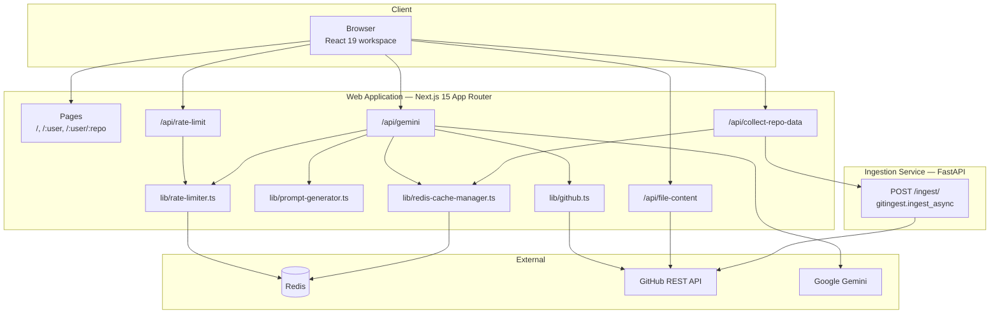
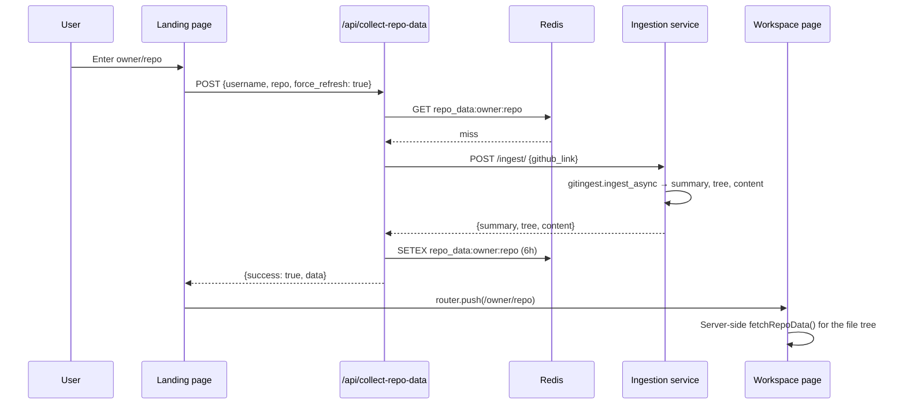
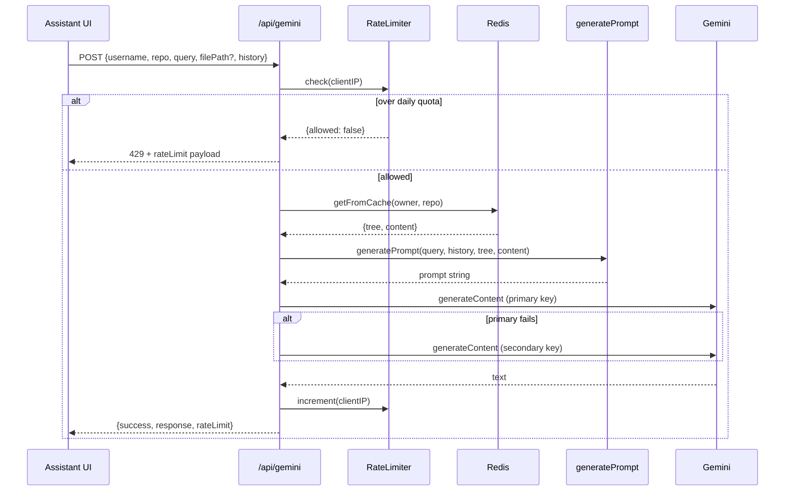
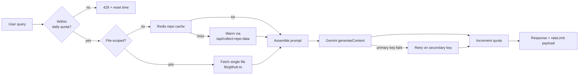
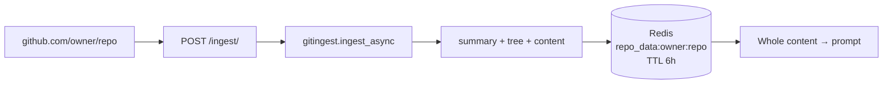
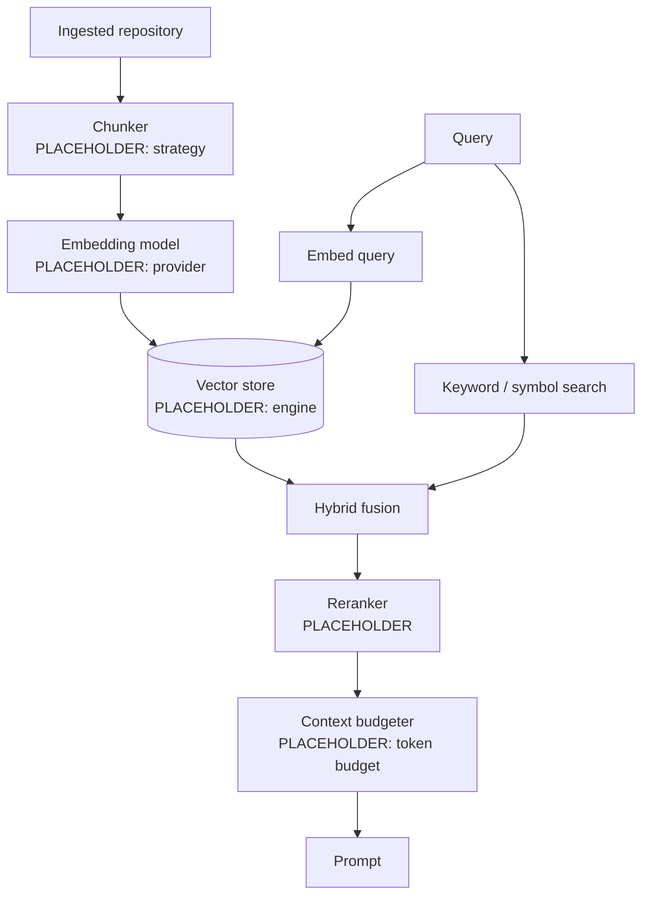

# CodeAtlas — Engineering Notebook

> **This document is the single source of truth for CodeAtlas.**
> Architecture decisions, roadmap, known limitations and open questions live here. If the code and this notebook disagree, one of them is a bug — fix the code or fix the notebook, but do not leave them out of sync.

| | |
| --- | --- |
| **Project** | CodeAtlas — AI-powered Repository Intelligence Platform |
| **Status** | Early / pre-1.0. Interfaces unstable. |
| **Notebook created** | 2026-08-09 |
| **Last reviewed** | 2026-08-09 |
| **Maintainer** | Bharathi |

**Legend:** `TODO` = known gap with an owner-less action. `TBD` = decision not yet made. `PLACEHOLDER` = implementation detail not yet known; fill in when it lands.

---

## Table of Contents

1. [Project Vision](#1-project-vision)
2. [Goals](#2-goals)
3. [Current Architecture](#3-current-architecture)
4. [Folder Structure](#4-folder-structure)
5. [Technology Stack](#5-technology-stack)
6. [Existing Features](#6-existing-features)
7. [Known Limitations](#7-known-limitations)
8. [Planned Features](#8-planned-features)
9. [AI Pipeline](#9-ai-pipeline)
10. [Retrieval Pipeline](#10-retrieval-pipeline)
11. [Database Design](#11-database-design)
12. [API Design](#12-api-design)
13. [UI/UX Notes](#13-uiux-notes)
14. [Implementation Phases](#14-implementation-phases)
15. [Decisions & Tradeoffs](#15-decisions--tradeoffs)
16. [TODO Checklist](#16-todo-checklist)
17. [Future Ideas](#17-future-ideas)

---

## 1. Project Vision

Reading an unfamiliar codebase is archaeology. You open files at random, infer module boundaries from directory names, and reconstruct intent from identifiers. The knowledge you build is expensive, private, and evaporates when you move on.

**CodeAtlas turns a repository into navigable intelligence.**

The atlas metaphor is the product thesis. An atlas is not a pile of facts about terrain — it is a *rendering* of terrain at a chosen scale, with a legend, consistent projection, and the ability to zoom from continent to street without losing your place. CodeAtlas aims to do the same for software: one coherent model of a repository that can be queried at the altitude the question demands, from "what is this project" down to "why does this function take a nullable second argument".

Three commitments follow from that:

1. **Grounded, not recalled.** Every answer is derived from the repository actually in front of us, not from the model's prior about what projects like this usually look like. When CodeAtlas does not know, it says so.
2. **Whole-system by default.** The unit of understanding is the repository, not the file. Questions about how things connect are the questions that matter most and are the ones single-file tools answer worst.
3. **Navigation and explanation are one surface.** Explanation detached from the code is documentation, and documentation rots. The explorer and the assistant share one context so the answer is always anchored to something you can click.

**Non-goals (deliberate, revisit only with a recorded decision):** CodeAtlas is not an IDE, not a code-generation product, and not a CI/quality gate. It is a comprehension layer.

---

## 2. Goals

### Product goals

| # | Goal | Success looks like | Status |
| --- | --- | --- | --- |
| P1 | A newcomer understands a mid-sized repository's architecture in under 10 minutes | Measured against a scripted comprehension task | Partly met |
| P2 | Every answer is traceable to specific files | Answers cite paths; citations are clickable | Partly met (cites paths, not clickable) |
| P3 | Any public GitHub repository works with zero setup | Paste a URL, get a workspace | Met for small/medium repos |
| P4 | Large repositories are first-class, not a failure mode | 100k+ LOC repos answerable | **Not met** — see [§7](#7-known-limitations) |
| P5 | Repeat visits are instant | Warm cache serves in < 1s | Met (6h Redis TTL) |

### Engineering goals

- **Correctness over coverage.** A wrong architectural explanation is worse than no explanation; it gets repeated in a design doc.
- **Cost-bounded by construction.** Per-repository and per-user cost must be predictable before a request is issued, not discovered on the invoice.
- **Provider-swappable AI.** The answering model is an implementation detail behind an interface. `TODO` — the interface does not exist yet; `@google/generative-ai` is called directly from the route handler.
- **Honest degradation.** Cache miss, rate limit, oversized repo and provider outage each have a defined, user-legible behaviour.

### Explicit non-goals for v1

- Private repository support (needs an auth story — see [§8](#8-planned-features))
- Multi-repository / organisation-wide analysis
- Write access of any kind (no PRs, no commits, no edits)

---

## 3. Current Architecture

CodeAtlas is **two deployable services** plus **two stateful dependencies**.



### Request flows

**A. First visit to a repository (cold)**



**B. Asking a question**



### Architectural notes

- **The ingestion service exists because `gitingest` is Python.** It is a thin HTTP wrapper — one real endpoint plus a `/ping` health check — deployed separately (Render config in `render.yaml`) because Next.js route handlers cannot host a Python dependency.
- **The web app is the only stateful coordinator.** The ingestion service is stateless; all caching and quota state lives in Redis, reachable from the web app only.
- **There is no background job system.** Ingestion happens inline within a request, bounded by a 120s `AbortController` timeout. This is the single biggest constraint on repository size ([§7](#7-known-limitations), [§15 D-6](#15-decisions--tradeoffs)).
- **`RepoAnalyzer` is an invisible component.** Mounted by the workspace layout, it renders `null` and exists only to fire a warm-the-cache `POST /api/collect-repo-data` on mount, with retry-on-429 backoff.

---

## 4. Folder Structure

The repository is organised by **deployable unit**, not by language. Each top-level
directory maps to something that ships or supports shipping: `frontend/` and
`backend/` are the two services, `docker/` and `.github/` build them, `docs/`
explains them.

```
codeatlas/
├── frontend/                     Next.js web application (the deployable web service)
│   ├── app/                      App Router
│   │   ├── layout.tsx            Root layout — fonts, theme provider, metadata
│   │   ├── page.tsx              Landing page (composes components/site/*)
│   │   ├── globals.css           Design tokens, surface treatments, keyframes
│   │   ├── features/page.tsx     Marketing: capability groups
│   │   ├── docs/page.tsx         Documentation reader
│   │   ├── [username]/
│   │   │   ├── page.tsx          GitHub profile + repository picker
│   │   │   └── [repo]/page.tsx   Workspace entry; renders RepoLayout
│   │   └── api/
│   │       ├── collect-repo-data/  Ingest + cache a repository (sole ingestion route)
│   │       ├── gemini/             Answering endpoint
│   │       ├── file-content/       Single-file fetch with in-process LRU cache
│   │       └── rate-limit/         Read current quota for the caller's IP
│   │
│   ├── components/
│   │   ├── site/                 Marketing surfaces — see §UI Architecture
│   │   ├── repo-layout.tsx       Three-pane resizable workspace shell
│   │   ├── file-explorer.tsx     Left pane — tree navigation
│   │   ├── file-viewer.tsx       Centre pane — dispatches to the right viewer
│   │   ├── notebook-viewer.tsx   .ipynb rendering
│   │   ├── pdf-viewer.tsx        PDF rendering (dynamically imported)
│   │   ├── code-block.tsx        Syntax-highlighted code with copy
│   │   ├── ai-assistant.tsx      Right pane — CodeAtlas chat
│   │   ├── repo-analyzer.tsx     Headless cache-warmer (renders null)
│   │   ├── enhanced-loading.tsx  Loading state with phase text
│   │   ├── theme-provider.tsx    next-themes wrapper
│   │   └── ui/                   shadcn/ui primitives
│   │
│   ├── lib/
│   │   ├── github.ts             Octokit client, lazy init, tree fetch, memo caches
│   │   ├── prompt-generator.ts   Prompt assembly + cached repo-data reader
│   │   ├── redis-cache-manager.ts  Redis repository cache (6h TTL)
│   │   ├── rate-limiter.ts       Per-IP daily quota + shared getClientIP()
│   │   ├── logger.ts             Structured console logger
│   │   ├── site-content.ts       Copy + data for the marketing surfaces
│   │   ├── showcase-panels.ts    Tagged-union data for the product showcase
│   │   ├── docs-content.ts       Documentation sections
│   │   └── utils.ts              `cn()` class merge helper
│   │
│   ├── hooks/                    useGithubStars, use-mobile, use-toast
│   ├── public/                   logo.svg
│   ├── styles/                   markdown.css (imported by file-viewer)
│   ├── package.json              Frontend manifest — pnpm workspace root for the app
│   ├── next.config.mjs           TypeScript and ESLint enforced
│   ├── tailwind.config.ts        Tailwind theme bound to the CSS tokens
│   ├── .eslintrc.json            next/core-web-vitals + no-unused-vars
│   └── tsconfig.json             `@/*` → frontend root
│
├── backend/                      Python ingestion service (the deployable API)
│   ├── main.py                   FastAPI app: POST /ingest/, GET|HEAD /ping
│   ├── requirements.txt          Authoritative Python deps
│   └── tests/                    Ingestion smoke checks
│
├── database/                     Reserved. No database exists yet — see §11.
├── docker/                       Dockerfile + .dockerignore (build from repo root)
├── docs/                         ENGINEERING_NOTEBOOK.md ← you are here
├── .github/workflows/            CI: frontend typecheck/lint/build, backend import check
│
├── .env.example                  Documented environment contract
├── render.yaml                   Ingestion service deployment (rootDir: backend)
├── CLAUDE.md                     Agent working notes
├── LICENSE                       MIT
└── README.md
```

**Why this shape.** The previous flat layout mixed a Next.js app, a Python
service and their shared infrastructure at one level, so "where does this file
go" had no answer and the two services' configs collided in the root. Splitting
by deployable unit gives each service one obvious home with its own manifest,
lockfile and lint config, and leaves the root holding only things that describe
the repository as a whole.

`database/` is currently **empty and intentional**: it reserves the location for
the schema in [§11](#11-database-design), which is designed but not built. If
persistence is abandoned, delete the directory rather than leaving it as decor.

---

## 5. Technology Stack

### Web application

| Layer | Choice | Version | Notes |
| --- | --- | --- | --- |
| Framework | Next.js (App Router) | 15.3.6 | Server components for the workspace shell; route handlers for the API |
| UI runtime | React | 19 | |
| Language | TypeScript | 5.x | `strict: true`; enforced at build time |
| Styling | Tailwind CSS | 3.4.17 | `tailwindcss-animate`, CSS custom properties for theming |
| Components | shadcn/ui + Radix UI | — | `components.json`, neutral base colour, `lucide` icons |
| Theming | next-themes | 0.4.4 | Dark-locked at the root layout today |
| Markdown | react-markdown + remark-gfm + rehype-raw | — | Renders assistant output |
| Syntax highlighting | react-syntax-highlighter | — | |
| Documents | react-pdf | — | PDF viewing |
| Layout | react-resizable-panels | 2.1.7 | Three-pane workspace |
| Telemetry | @vercel/analytics, @vercel/speed-insights | — | Plus optional env-gated Rybbit |

### AI and data

| Concern | Choice | Notes |
| --- | --- | --- |
| Answering model | Google Gemini `gemini-2.5-flash-lite` | via `@google/generative-ai` |
| Repository ingestion | `gitingest` (Python) | Wrapped by the FastAPI service |
| Source of truth for files | GitHub REST API via `@octokit/rest` | |
| Cache + quota store | Redis via `ioredis` | |
| Embeddings / vector DB | **none** | See [§10](#10-retrieval-pipeline) |
| Relational DB | **none** | See [§11](#11-database-design) |

### Ingestion service

FastAPI ≥ 0.112, Uvicorn ≥ 0.30, gitingest ≥ 0.3.1, httpx, aiohttp, pydantic ≥ 2.8.

### Declared-but-unused dependencies

Phase 1 removed eighteen packages in two passes.

The first pass took nine that nothing imported at all: `@supabase/supabase-js`, `supabase` (CLI), `@ai-sdk/openai`, `ai`, `@react-pdf/renderer`, `prism-react-renderer`, `@hookform/resolvers`, `zod` and `@types/chalk`.

The second pass took nine more that were imported by exactly one unreachable shadcn primitive: `recharts`, `embla-carousel-react`, `vaul`, `input-otp`, `react-day-picker`, `date-fns`, `react-hook-form`, `cmdk` and `sonner`. Each primitive was deleted with its dependency — see [§15 D-11](#15-decisions--tradeoffs).

Twenty-six pure-Radix primitives in `components/ui` are still unreachable from any page. They were kept: each is a thin wrapper over a `@radix-ui/*` package already in the tree, so they cost little and are the expected surface of a shadcn/ui project ([§15 D-11](#15-decisions--tradeoffs)).

---

## 6. Existing Features

Verified against the code as of 2026-08-09.

### Shipped and working

| Feature | Where | Notes |
| --- | --- | --- |
| Repository ingestion by URL or `owner/repo` | `app/page.tsx` → `/api/collect-repo-data` | Accepts full GitHub URLs and bare `owner/repo` |
| Three-pane workspace | `components/repo-layout.tsx` | Resizable and collapsible; explorer / viewer / assistant |
| File tree navigation | `components/file-explorer.tsx` | Driven by `fetchRepoData()` |
| Syntax-highlighted file viewing | `file-viewer.tsx`, `code-block.tsx` | Selected file is tracked in the `?file=` query param |
| Jupyter notebook rendering | `notebook-viewer.tsx` | Cells and outputs |
| PDF rendering | `pdf-viewer.tsx` | Dynamically imported to keep it out of the main bundle |
| Repository-scoped chat | `ai-assistant.tsx` → `/api/gemini` | Markdown, tables, mermaid-capable output |
| File-scoped chat | same, `fetchOnlyCurrentFile` | Sends only the open file to keep the prompt small |
| Quick prompts | `ai-assistant.tsx` | Explain structure / dependencies / improvements / README / tests |
| README generation | `lib/prompt-generator.ts` | Heavily constrained output format |
| Two-key AI failover | `app/api/gemini/route.ts` | Secondary Gemini key on primary failure |
| Per-IP daily quota | `lib/rate-limiter.ts` | 20 requests/day, 24h window, **fails open** on Redis error |
| Live quota display | `components/ui/ai-rate-limit.tsx` | Updated via an `aiRateLimitUpdate` window event |
| Repository cache | `redis-cache-manager.ts` | 6h TTL, key `repo_data:{owner}:{repo}` |
| File content cache | `/api/file-content` | In-process LRU, 100 entries, 10-min TTL |
| GitHub user profile page | `app/[username]/page.tsx` | Profile + searchable repo list |
| Dark theme | `app/layout.tsx` | Locked to dark; toggle component exists |

### Partially implemented

- **Theme switching** — `ThemeToggle` is rendered in the assistant header, but the root layout hardcodes `className="dark"` with `enableSystem={false}`. Light mode is unreachable in practice.
- **Conversation history** — `/api/gemini` accepts a `history` array and `generatePrompt` formats it, but `ai-assistant.tsx` never sends one. **Every turn is effectively stateless.** This is the highest-value small fix available.

---

## 7. Known Limitations

Ordered roughly by severity. These are honest liabilities, not a wish list.
Limitations resolved in Phase 1 have been removed; see [§14](#14-implementation-phases) for what was closed.

### L1 — Retrieval is prompt-stuffing, not retrieval

The entire repository's flattened content is concatenated into a single prompt. There is no chunking, ranking, or selection. Consequences:

- Large repositories overflow the context window and either error or silently truncate.
- Token cost scales with repository size on *every question*, not with question complexity.
- Answer quality degrades with repository size — the needle gets lost.
- `maxOutputTokens: 2048` caps answers regardless of how much context was supplied.

This is the defining architectural limitation. See [§10](#10-retrieval-pipeline) for the intended replacement.

### L2 — No repository size guard

Nothing checks size before ingestion. The failure mode for a large repository is a 120s timeout or a provider context error, surfaced as a generic message. The ingestion service defaults `max_file_size` to 50 MB *per file*, which is far too permissive.

### L3 — Conversation is stateless

`/api/gemini` accepts a `history` array and `generatePrompt` formats it, but `ai-assistant.tsx` never sends one. Follow-up questions ("and what about the other one?") cannot work.

### L4 — Rate limiter fails open

On any Redis error, `RateLimiter.check()` returns `allowed: true`. A Redis outage removes all AI spend protection. Deliberate tradeoff ([§15 D-5](#15-decisions--tradeoffs)) but unbounded in the wrong direction.

### L5 — IP-based quota is weak

`x-forwarded-for` is trivially spoofable without a trusted proxy, and shared NATs punish co-located users. No account system exists to do better.

### L6 — Public repositories only

No GitHub OAuth. Private repositories cannot be ingested.

### L7 — No tests

Zero test files. `typecheck` / `lint` / `build` are now enforced on every push and pull request by `.github/workflows/ci.yml`, but nothing asserts *behaviour* — prompt assembly, cache managers and the rate limiter all go unverified. `test_api.py` is a manual smoke script, not a test suite.

## 8. Planned Features

Not yet implemented. Nothing here should be treated as committed until it appears in [§14](#14-implementation-phases).

### Near term

| Feature | Sketch |
| --- | --- |
| **Conversation memory** | Send the trailing N turns from `ai-assistant.tsx`; the server already accepts them. Summarise older turns once the window is tight. |
| **Repository size preflight** | Query the GitHub API for size before ingesting; refuse or degrade gracefully above a threshold. `TBD` — threshold. |
| **Streaming responses** | Stream tokens instead of awaiting the full generation. Removes the perceived latency wall on long answers. |
| **Clickable citations** | Parse file paths out of answers and link them into the explorer. Closes product goal P2. |
| **Answer-level caching** | Cache `(repo, normalised query)` → answer in Redis. Cheap win on repeated common questions. |

### Medium term

| Feature | Sketch |
| --- | --- |
| **Real retrieval pipeline** | Chunk → embed → vector search → rerank. See [§10](#10-retrieval-pipeline). Unblocks P4. |
| **Dependency graph** | Parse imports into a graph; render interactively. |
| **Persisted sessions** | Named, revisitable conversations per repository. Requires [§11](#11-database-design). |
| **User accounts** | GitHub OAuth. Prerequisite for private repos and per-user quotas. |
| **Private repositories** | Ingest with the user's own token, scoped to their session. Needs a careful data-retention policy. |
| **Provider abstraction** | An `AIProvider` interface so Gemini is swappable. |

### Longer term

Architecture Decision Record extraction · onboarding walkthroughs generated per-repository · diff-aware "what changed and why it matters" · IDE extension · team workspaces with shared annotations · PR review context.

---

## 9. AI Pipeline

### Current implementation



### Model configuration

| Parameter | Value | Where | Rationale |
| --- | --- | --- | --- |
| Model | `gemini-2.5-flash-lite` | `app/api/gemini/route.ts` | Cost and latency; large context window suits prompt-stuffing |
| `temperature` | `0.8` | same | ⚠️ High for a factual, grounded task. `TODO` — evaluate 0.2–0.4. |
| `maxOutputTokens` | `2048` | same | Truncates long architectural answers (L1) |
| Timeout | 120s | `AbortController` | Matches the ingestion timeout |
| Fallback | Secondary API key | `generateWithFallback()` | Both-fail surfaces a combined error |

### Prompt structure

Assembled by `generatePrompt()` in `lib/prompt-generator.ts`. Two variants share one skeleton:

```
Role preamble
CURRENT QUERY:            <query>
CODEBASE INFORMATION:
  - Folder Structure:     <tree>
  - File Content:         <full flattened content>
CONVERSATION HISTORY:     <formatted history — currently always empty, L3>
INSTRUCTIONS               ← branches: README-generation vs. general Q&A
FORMAT GUIDELINES          ← markdown, fenced code with language, mermaid for architecture
RESPONSE LENGTH GUIDELINES ← scales verbosity to query specificity
HANDLING UNCERTAINTY       ← must state when information is absent
COMMON TASKS
SECURITY GUIDELINES        ← refuse instruction-override; no exploit generation
```

Notable choices:

- **Query-first ordering.** The query is repeated near the top so it is not buried under a large content block.
- **Length calibration is instructed, not enforced.** Greetings get 1–2 lines, overviews 3–5, technical answers as needed.
- **Mermaid is requested by default for architecture questions**, and the client renders it.
- **README mode is aggressively constrained** — output must be a single fenced ```markdown block with nothing outside it, because downstream handling assumes that shape.

### Prompt injection posture

`SECURITY GUIDELINES` instructs the model to refuse instruction-override attempts and to stay scoped to the codebase. **This is prompt-level mitigation only.** Repository content is untrusted input concatenated into the same context as system instructions, so a repository containing adversarial text can attempt to steer output. Blast radius today is limited — CodeAtlas has no write capability, no tools, and no cross-user data — but this must be revisited before any tool use or authenticated action is added. `TODO` — record a threat model.

### Guardrails not yet present

Token counting before dispatch · cost attribution per request · output validation for README mode · retry with backoff distinct from key failover · eval suite for answer quality (`PLACEHOLDER` — no methodology chosen).

---

## 10. Retrieval Pipeline

### Current: single-pass whole-repository ingestion



There is **no retrieval step**. "Retrieval" today means "read the cache entry and paste all of it".

**Cache layers, in order of proximity:**

| Layer | Key | TTL | Scope | Location |
| --- | --- | --- | --- | --- |
| Redis repository cache | `repo_data:{owner}:{repo}` | 6h | Cross-instance | `lib/redis-cache-manager.ts` |
| File-content LRU | `{owner}/{repo}/{path}` | 10 min, 100 entries | Per-process | `app/api/file-content/route.ts` |
| Octokit tree memo | in-module | 30 min | Per-process | `lib/github.ts` |
| Token validation | in-module | 5 min | Per-process | `lib/github.ts` |

Only the file-scoped query path (`fetchOnlyCurrentFile`) does anything selective, and its selection is "the file the user has open" — a UI signal, not retrieval.

### Target: chunk → embed → search → rerank

The intended replacement, not yet built.



**Open decisions — all `TBD`:**

| Decision | Options considered | Notes |
| --- | --- | --- |
| Chunking strategy | Fixed-window · AST/symbol-aware · file-level with summaries | Symbol-aware is better for code but needs a parser per language (tree-sitter). |
| Embedding provider | Gemini embeddings · OpenAI · local (bge / nomic) | Cost vs. latency vs. operational burden. |
| Vector store | pgvector (Supabase) · Qdrant · Redis vector · Vectorize | Supabase deps are already declared — a hint at earlier intent, not a decision. |
| Hybrid search | BM25 + dense · dense only | Identifier search is exact-match-heavy; pure dense retrieval is known to underperform on symbol lookup. |
| Reranking | Cross-encoder · LLM rerank · none | |
| Context budget | Fixed tokens · adaptive by query class | Must be enforced *before* dispatch. |
| Invalidation | Commit SHA keyed · webhook-driven · TTL | Current 6h TTL means a repo can be stale by up to 6 hours. |
| Incremental re-index | Diff-based · full re-ingest | Full re-ingest is only viable while repos are small. |

**Migration constraint:** the cache key must gain a version and a commit SHA component (`repo_data:v2:{owner}:{repo}:{sha}`) so the two schemes can coexist during rollout.

---

## 11. Database Design

### Current state: there is no database

CodeAtlas is stateless apart from Redis. Nothing survives a 6-hour TTL. No user data is stored — no accounts, no conversation logs, no analytics beyond the optional third-party scripts.

`@supabase/supabase-js` is a declared dependency but **is not imported anywhere**. Treat its presence as vestigial, not as a decision.

### Redis keyspace (the only persistence today)

| Key pattern | Type | Value | TTL | Written by |
| --- | --- | --- | --- | --- |
| `repo_data:{owner}:{repo}` | string | JSON `{summary, tree, content, files[]}` | 6h | `RedisCacheManager.saveToCache` |
| `ratelimit:{ip}` | string | JSON `{count, resetAt}` | until `resetAt` | `RateLimiter.increment` |

### Proposed schema (design only — not implemented)

Needed once accounts, persisted sessions, or a vector index land. Postgres assumed; engine is `TBD`.

```sql
-- PROPOSED. Not created. Illustrative only.

users (
  id             uuid primary key,
  github_id      bigint unique not null,
  github_login   text not null,
  avatar_url     text,
  created_at     timestamptz not null default now(),
  last_seen_at   timestamptz
)

repositories (
  id             uuid primary key,
  owner          text not null,
  name           text not null,
  default_branch text,
  is_private     boolean not null default false,
  last_indexed_at timestamptz,
  indexed_sha    text,                    -- drives cache invalidation
  size_bytes     bigint,
  unique (owner, name)
)

sessions (
  id             uuid primary key,
  user_id        uuid references users(id) on delete cascade,
  repository_id  uuid references repositories(id) on delete cascade,
  title          text,
  created_at     timestamptz not null default now()
)

messages (
  id             uuid primary key,
  session_id     uuid references sessions(id) on delete cascade,
  role           text not null check (role in ('user','assistant')),
  content        text not null,
  cited_paths    text[],                  -- powers clickable citations
  token_count    int,
  model          text,
  created_at     timestamptz not null default now()
)

chunks (                                   -- requires §10 retrieval work
  id             uuid primary key,
  repository_id  uuid references repositories(id) on delete cascade,
  path           text not null,
  start_line     int,
  end_line       int,
  content        text not null,
  symbol_name    text,
  embedding      vector(PLACEHOLDER),     -- dimension follows provider choice
  indexed_sha    text not null
)

usage_events (                             -- replaces IP-based quota
  id             uuid primary key,
  user_id        uuid references users(id) on delete set null,
  ip_hash        text,                     -- hashed, never raw
  event_type     text not null,
  tokens_in      int,
  tokens_out     int,
  cost_usd       numeric(10,6),
  created_at     timestamptz not null default now()
)
```

**Open questions:** retention policy for private-repo content (`TBD` — likely never persist chunk content, only embeddings) · whether `chunks` belongs in Postgres or a dedicated vector engine · GDPR/deletion story once accounts exist · whether `messages.content` should be retained at all by default.

---

## 12. API Design

All web-app endpoints are Next.js route handlers under `app/api/`. None are versioned or authenticated — `TODO` for both.

### `POST /api/collect-repo-data` — primary ingestion

Ingests a repository (or serves cache) and stores the result in Redis.

```jsonc
// Request
{ "username": "vercel", "repo": "next.js", "force_refresh": false }

// 200 — identical shape whether served from cache or freshly ingested
{
  "success": true,
  "cached": true,
  "data": { "summary": "...", "tree": "...", "content": "...", "files": [] }
}
```

| Status | Meaning |
| --- | --- |
| 200 | Ingested or served from cache |
| 403 | Repository private, or GitHub rate limit hit |
| 404 | Repository not found |
| 413 | Repository too large to process |
| 500 | `GITINGEST_API_URL` unset, malformed response from the ingestion service, or ingestion failure |

Both paths return the same envelope and the same `data` object that was written to cache; `cached` distinguishes them for observability only. The cache bypass parameter is `force_refresh` on both the client and the handler.

### `POST /api/gemini` — answering endpoint

```jsonc
// Request
{
  "username": "vercel",
  "repo": "next.js",
  "query": "How does routing work?",
  "filePath": "packages/next/src/server/router.ts",  // optional
  "fetchOnlyCurrentFile": false,
  "history": []                                       // accepted; client never sends it (L3)
}

// 200
{ "success": true, "response": "markdown…", "rateLimit": { "allowed": true, "remaining": 17, "limit": 20, "resetAt": 1765324800 } }

// 429
{ "success": false, "error": "Daily limit of 20 AI requests reached. Resets at …", "rateLimited": true, "rateLimit": { … } }
```

| Status | Meaning |
| --- | --- |
| 200 | Answer generated |
| 429 | Daily per-IP quota exhausted |
| 500 | Generation failed (both keys) |
| 504 | Exceeded the 120s timeout |

### `GET /api/file-content` — single file

`?path=<path>&username=<owner>&repo=<name>` → `{ "success": true, "data": "<file contents>" }`. Text is base64-decoded; binaries (`jpg|jpeg|png|gif|svg|webp|bmp|ico|pdf`) are returned still base64-encoded for the client to decode. Truncates above 50 MB with an explicit marker. Errors return `{ "success": false, "error": "..." }`: `400` missing params · `404` not found · `429` GitHub rate limit · `500` otherwise.

### `GET /api/rate-limit` — quota introspection

Returns `{success, allowed, remaining, limit, resetAt}` for the caller's IP. Read-only; does not increment.

### Ingestion service (FastAPI)

| Endpoint | Request | Response |
| --- | --- | --- |
| `POST /ingest/` | `{github_link, max_file_size?}` — link must start with `https://github.com/` | `{summary, tree, content}` |
| `GET\|HEAD /ping` | — | `{"message": "pong"}` |

CORS is `allow_origins=["*"]`. Acceptable while the service is stateless and unauthenticated; **must be tightened** before it ever touches private repositories or credentials. `TODO`.

### Conventions to adopt

As of Phase 1 every route returns `{ success: boolean, data?: T, error?: string }`. Two pieces are still `TBD` and belong to Phase 2: promoting `error` to a structured `{ code, message }` so failures are machine-readable, and threading a request ID through for tracing.

---

## 13. UI/UX Notes

### Design language

Dark-only, high-contrast, code-forward. The reference points are Linear, Cursor, Raycast and Warp — a developer tool that signals engineering quality, not a marketing SaaS site. The workspace should feel closer to an IDE than to a chat app: chat is one pane, not the product.

### Design system

**Colour.** A single violet accent on a near-black charcoal ground, defined once as HSL triples in `frontend/app/globals.css` and consumed only through Tailwind tokens. No component hardcodes a hex value or a palette class such as `emerald-500`.

| Token | Value | Role |
| --- | --- | --- |
| `--background` | `240 11% 4%` (#08080a) | Page ground |
| `--card` | `240 10% 8%` (#131317) | Elevated surface |
| `--surface-raised` | `240 9% 11%` (#1a1a1f) | Second elevation — chrome bars, track fills |
| `--foreground` | `240 8% 95%` (#f1f1f3) | Primary text |
| `--muted-foreground` | `240 3% 60%` | Secondary text |
| `--faint` | `240 2% 38%` | Metadata, disabled |
| `--border` | `240 4% 13%` | Hairline dividers |
| `--primary` | `258 90% 66%` (#8b5cf6) | Accent, CTAs, focus ring |
| `--primary-foreground` | `240 11% 4%` | Text on the accent |
| `--accent-2` | `239 84% 67%` (#6366f1) | Gradient mid-stop, secondary series |
| `--accent-3` | `217 91% 60%` (#3b82f6) | Gradient end-stop, tertiary series |

Violet is used sparingly and never at full saturation across large areas — it marks the accent, the active state and the focus ring, and everything else is greyscale. That restraint is what separates a developer tool from a marketing page.

**Typography.** Three faces, each with one job. Bricolage Grotesque (`font-head`) for display and the wordmark; IBM Plex Sans (`font-sans`) for body and UI; JetBrains Mono (`font-mono`) for every code path, repository name, metric, command and badge. Mono usage is semantic, not decorative — if it is an identifier the machine cares about, it is mono.

**Surface treatments.** Four utilities in `globals.css` carry the visual language:
`.ca-grid` (48px blueprint graticule), `.ca-scanlines` (fixed CRT veil),
`.ca-btn-gradient` (the purple→violet primary action, with a soft violet glow on
hover), and `.ca-glow-hover` (cards lift with a violet wash rather than a drop
shadow). Elevation is otherwise expressed with borders and background steps.

**Focus.** A single global `:focus-visible` rule paints a two-tone ring — a
background-coloured inner ring plus a violet outer ring — so keyboard focus is
visible on every control regardless of the surface behind it.

**Motion.** Fade, opacity, small translate and gradient shift only — `ca-pulse`
for the status dot and `ca-scan` for the veil. No bouncing, no spinning beyond
the single loading indicator. A global `prefers-reduced-motion` block reduces
every animation and transition to ~0ms.

### The surfaces

**Landing** (`/`) — hero and command bar, the three-stage pipeline, the tabbed product showcase, a comparison table, the capability grid, and a closing CTA. Ingestion runs *before* navigation, with the loading state narrating its phase ("Fetching repository data…", "Analyzing repository…", "Repository analyzed successfully") so a 30–120s wait does not read as a hang.

**Features** (`/features`) — four capability groups rendered from `FEATURE_GROUPS`.

**Docs** (`/docs`) — sticky section index plus a prose column, rendered from `DOC_SECTIONS`. Anchor-linked, so it stays a server component.

**Workspace** (`/{owner}/{repo}`) — three resizable panes:

```
┌───────────────┬────────────────────────────┬──────────────────────┐
│ File Explorer │  File Viewer               │  CodeAtlas Assistant │
│ 20% (15–30)   │  50% (min 30)              │  30% (20–50)         │
│ collapsible   │                            │  collapsible         │
└───────────────┴────────────────────────────┴──────────────────────┘
```

Selected file lives in the `?file=` query param, so a workspace view is shareable and back/forward works.

### UI architecture

Marketing components live in `frontend/components/site/` and are composed by the
page files. Every section is presentational and reads its copy from
`lib/site-content.ts`, so a content change never touches JSX and no section
duplicates another's markup.

```
SiteShell                        grid + scanline veil + navbar + footer
├── SiteNavbar                   sticky; star pill, Sign in, gradient CTA
│   └── LogoMark                 shared brand glyph (also used in the mock)
├── <page sections>
└── SiteFooter

Landing (app/page.tsx)
├── Hero                         split layout; artwork right, copy left
│   ├── ContourArt               inline SVG topographic rings + survey point
│   └── CommandBar               ← the only ingestion-bearing component
│       └── RepoChips            ← EXAMPLE_REPOS
├── HowItWorks                   ← PIPELINE_STEPS, one card, three columns
├── ProductShowcase              ← PLATFORM_POINTS, selectable list
│   └── WorkspaceMock            static product imagery
├── MorePages                    ← MORE_PAGES, each with an abstract preview
└── TrustStrip                   ← TRUST_ITEMS

Features (app/features/page.tsx) → FEATURE_GROUPS, then CtaBand
Docs     (app/docs/page.tsx)     → DOC_SECTIONS, SiteShell withFooter={false}
```

Only `SiteNavbar`, `CommandBar`, `RepoChips` and `ProductShowcase` are client
components; everything else renders on the server. `CtaBand` is shared by the
features page and remains available to the landing page.

**Mocks are labelled as mocks.** `WorkspaceMock` and the `MorePages` previews are
illustrative product imagery, not live views, and say so in their file comments.
They are built from tokens and primitives rather than screenshots, so they cannot
drift out of the design system.

### Navigation

| Route | Surface | Rendering |
| --- | --- | --- |
| `/` | Landing | Static |
| `/features` | Capability groups | Static |
| `/docs` | Documentation reader | Static, anchor-linked |
| `/{owner}` | GitHub profile + repo picker | Dynamic (client fetch) |
| `/{owner}/{repo}` | Workspace | Dynamic (server-fetched tree) |

`NAV_LINKS` drives the navbar; the active link is derived from `usePathname()`
and marked with `aria-current="page"`. The primary CTA targets `/#map`, which
anchors the command bar. The workspace routes deliberately keep their own
chrome — they are the application, not the site — and are not wrapped in
`SiteShell`.

### Interaction principles

1. **Never a bare spinner.** Long operations name their current phase.
2. **Quick prompts lower the blank-page cost.** Five one-tap starters; the first is context-aware (`Explain this file` when a file is open, `Explain structure` otherwise).
3. **Quota is always visible.** `AIRateLimit` in the header, updated live from each response via an `aiRateLimitUpdate` window event, so exhaustion is never a surprise.
4. **The assistant is honest.** A persistent "AI can make mistakes. Review generated code before use." note sits under the composer.
5. **Enter sends, Shift+Enter newlines.** Standard, and the input auto-refocuses after each response.
6. **Errors are actionable.** Timeouts suggest a smaller repository or a file-scoped question rather than reporting a raw failure.

### Known UX gaps

- No visible streaming — the assistant is silent until the whole answer lands.
- File paths in answers are plain text, not links (product goal P2).
- No conversation history across turns is visible *because* there is none (L3).
- Light mode is unreachable: the root layout hardcodes `className="dark"` with `enableSystem={false}`, yet a theme toggle is rendered. CodeAtlas is dark-only by design, so the toggle is the thing that should go.
- No mobile layout for the workspace; three resizable panes assume a wide viewport. The marketing surfaces are responsive from 360px up.
- No empty state for repositories that ingest successfully but contain nothing renderable.

`PLACEHOLDER` — no formal accessibility audit has been done. The design migration added the mechanical pieces (`aria-current` on the active nav link, `role="tablist"`/`tab`/`tabpanel` with `aria-selected` and `aria-controls` on the showcase, `aria-invalid` + `aria-describedby` on the command bar, `role="status"` on the loading text, `aria-hidden` on every decorative glyph, and a global reduced-motion block). What is unverified: measured contrast ratios, keyboard traversal across the three workspace panes, and screen-reader behaviour for assistant markdown.

---

## 14. Implementation Phases

### Phase 0 — Rebrand and establish the notebook ✅ *complete (2026-08-09)*

Established CodeAtlas branding across UI, metadata, configuration and documentation; wrote Repository Intelligence Platform positioning; moved every third-party identifier behind an environment variable and removed those that were hardcoded (analytics site ID, Google site-verification token, external account links); created an original logo mark; added `.env.example`; created this notebook.

### Phase 1 - Foundation and honesty [COMPLETE] *(2026-08-09)*

Made the codebase tell the truth about itself before building on it.

- [x] Deleted dead code - `api/analyze`, `api/analyze-repo`, `repo-summary`, `repo-chat`, `repo-explorer`, duplicate `styles/globals.css`, root `requirements.txt`, `package.json.update`, and the vestigial `logger.embeddings.*` / `logger.search.*` helpers
- [x] Removed the broken `gitingest_bridge.py` path - `getRepoDataForPrompt()` is now a pure cache read that reports a miss instead of returning placeholder text
- [x] Fixed the `force` / `force_refresh` parameter mismatch
- [x] Normalised `/api/collect-repo-data` and `/api/file-content` onto one `{ success, data?, error? }` envelope
- [x] Re-enabled TypeScript and ESLint in the build and fixed everything that surfaced (27 lint errors, all unused bindings or `` violations)
- [x] Added a `LICENSE` file (MIT)
- [x] Pruned 18 unused dependencies across two passes
- [x] Removed 9 unreachable `components/ui` primitives and the `use-mobile` duplicate
- [x] Made `lib/github.ts` initialise lazily — no module-load side effect, no build noise
- [x] Fixed the invalid `properties.disk` block in `render.yaml`
- [x] Added CI enforcing `typecheck` / `lint` / `build` on every push and pull request

**Exit criterion — met and enforced.** `pnpm typecheck`, `pnpm lint` and `pnpm build` all pass with checks on, no module is unreferenced, and `.github/workflows/ci.yml` fails the build if that regresses. What remains untested is *behaviour*, not compilation — see [L7](#7-known-limitations).

### Phase 2 — Correctness and cost control

- [ ] Wire conversation history through from the client (L3)
- [ ] Repository size preflight with a clear refusal path (L2)
- [ ] Token counting before dispatch; enforce a context budget
- [ ] Lower `temperature` for factual queries and measure the difference
- [ ] Decide the rate-limiter fail-open/closed posture deliberately (L4)
- [ ] Structured error codes across all routes
- [ ] First tests: prompt assembly, cache managers, rate limiter

**Exit criterion:** cost per request is bounded and observable before the call is made.

### Phase 3 — Real retrieval

The unblocking phase for product goal P4. Depends on the `TBD` decisions in [§10](#10-retrieval-pipeline).

- [ ] Choose chunking strategy, embedding provider and vector store — record as ADRs
- [ ] Build the indexing pipeline with SHA-keyed invalidation
- [ ] Hybrid retrieval (dense + keyword) with reranking
- [ ] Versioned cache keys for coexistence during rollout
- [ ] Retrieval quality evaluation harness (`PLACEHOLDER` — methodology undecided)

**Exit criterion:** a 100k+ LOC repository is answerable with quality comparable to a small one.

### Phase 4 — Persistence and accounts

- [ ] Choose the database and stand up migrations
- [ ] GitHub OAuth
- [ ] Persisted, revisitable sessions
- [ ] Per-user quotas replacing IP-based limiting (L5)
- [ ] Private repository support with a written data-retention policy (L6)

### Phase 5 — Depth

- [ ] Streaming responses
- [ ] Clickable citations (P2)
- [ ] Dependency graph visualisation
- [ ] Mobile-viable workspace
- [ ] Accessibility audit and remediation

`PLACEHOLDER` — no dates or resourcing assigned. Phases are ordered by dependency, not scheduled.

---

## 15. Decisions & Tradeoffs

Decisions marked *(pre-existing)* were already baked into the codebase when this notebook was started. They were not deliberated here and should be re-examined on their merits rather than defended by default.

### D-1 — Two services instead of one *(pre-existing)*

**Decision.** Keep repository ingestion in a separate Python FastAPI service.
**Why.** `gitingest` is a Python library with no JavaScript equivalent of comparable quality.
**Gain.** Best-in-class ingestion; the ingestion service scales and fails independently of the web app.
**Cost.** Two deploy targets, two dependency ecosystems, a network hop on the cold path, and CORS surface.
**Revisit if.** A viable JS ingestion path appears, or the hop becomes a latency problem.

### D-2 — Prompt-stuffing over RAG *(pre-existing)*

**Decision.** Send the whole repository in the prompt; no embeddings.
**Why.** Ships in a day; large-context models make it viable for small repositories; zero vector infrastructure.
**Gain.** No chunking artefacts — the model sees genuinely everything. No index to build, invalidate or operate.
**Cost.** Hard ceiling on repository size (L1); token cost scales with repo size on every question; quality degrades as the needle gets lost.
**Status.** **This is the decision Phase 3 exists to reverse.** It was the right call to reach a working product and is now the primary constraint.

### D-3 — Gemini Flash Lite as the answering model *(pre-existing)*

**Decision.** `gemini-2.5-flash-lite`, single provider, called directly from the route handler.
**Why.** Large context window at low cost — the only economically viable pairing with D-2.
**Cost.** Provider lock-in with no abstraction layer; a weaker model than the frontier tier on hard reasoning.
**Mitigation in place.** Two-key failover covers key-level rate limits, not provider outages.
**Revisit.** Introduce an `AIProvider` interface in Phase 2 or 3 — the coupling gets more expensive the longer it stands.

### D-4 — Six-hour cache TTL *(pre-existing)*

**Decision.** Repository cache expires after 6 hours.
**Gain.** Bounded staleness with a simple, dependency-free invalidation story.
**Cost.** A repository can be up to 6 hours out of date with no way to know; a `force_refresh` exists but the UI never triggers it correctly.
**Better answer.** Key the cache on commit SHA (Phase 3) so it is exact rather than approximate.

### D-5 — Rate limiter fails open

**Decision.** On a Redis error, allow the request.
**Why.** Availability over cost protection — a cache outage should not take the product down.
**Cost.** A Redis outage removes all spend protection (L4).
**Assessment.** Defensible for a free, low-traffic deployment; **untenable once cost scales**. Phase 2 should make this a deliberate, configurable posture rather than a hardcoded default.

### D-6 — Synchronous ingestion, no job queue *(pre-existing)*

**Decision.** Ingest inline within the request, bounded at 120s.
**Gain.** No queue, no worker, no job-state model — dramatically less machinery.
**Cost.** Caps repository size at whatever fits in 120s; the user waits on the critical path; a failed ingestion has no retry story.
**Revisit.** Required before large-repository support (Phase 3).

### D-7 — IP-based quota *(pre-existing)*

**Decision.** 20 AI requests per IP per day.
**Why.** The only identity available without accounts.
**Cost.** Spoofable via `x-forwarded-for`; shared NATs punish co-located users (L5).
**Resolution.** Superseded by per-user quotas in Phase 4.

### D-8 — Build-error suppression *(pre-existing)*

**Decision.** `ignoreBuildErrors` and `ignoreDuringBuilds` both `true`.
**Assessment.** **This was a defect, not a tradeoff.** It converted compile-time failures into runtime ones and hid real bugs. **Reversed in Phase 1:** both flags are gone, `tsc --noEmit` and `next lint` are clean, and the production build enforces them.

### D-9 — All third-party identifiers are environment-driven *(2026-08-09)*

**Decision.** No analytics site ID, site-verification token, repository target or external account link is hardcoded. Each is read from an environment variable and disabled when unset.
**Why.** Hardcoded identifiers are the most commonly missed part of a rebrand and carry real consequences — a stray verification token lets someone else claim a deployed domain in Search Console, and a stray analytics ID ships your traffic data to an account you do not control.
**Cost.** The star widget is hidden by default until an operator configures `NEXT_PUBLIC_CODEATLAS_REPO_OWNER` / `_NAME`.

### D-11 — One response envelope, string errors for now *(2026-08-09)*

**Decision.** Every route returns `{ success, data?, error? }`, with `error` as a plain string. `/api/collect-repo-data` also returns `cached: true|false`, and returns the *same object it wrote to cache* on both paths.
**Why.** The hit and miss paths previously returned different shapes, forcing callers to handle both — and one of them silently didn't. Returning the cached object verbatim makes the two paths indistinguishable by construction rather than by discipline.
**Why not structured error codes yet.** `{ code, message }` is the right destination, but changing every call site belongs with the error-handling work in Phase 2 rather than being smuggled into a cleanup phase.
**Cost.** Clients still string-match on `error` for now.

### D-10 — This notebook is the source of truth *(this project, 2026-08-09)*

**Decision.** Architecture, roadmap, limitations and decisions live here rather than being scattered across README, code comments and issue threads.
**Why.** The failure mode of a young project is not absent knowledge but *unlocatable* knowledge. One file that must be read before contributing beats five that might be.
**Cost.** It must be maintained. A stale notebook is worse than none, because it is trusted. Every PR that changes architecture updates this file in the same commit.

### D-12 — A shadcn primitive earns its keep only if it is free *(2026-08-09)*

**Decision.** An unreachable `components/ui` primitive is deleted if it pulls a dedicated third-party dependency, and kept if it only wraps a `@radix-ui/*` package already present. Nine were deleted (`calendar`, `chart`, `carousel`, `drawer`, `input-otp`, `form`, `command`, `sonner`, plus the `use-mobile` duplicate); twenty-six Radix wrappers stay.
**Why.** "Delete everything unused" would strip the component library a shadcn project is expected to have; "keep everything" leaves nine packages installed for code no page can reach. The dependency cost is the line that separates the two — a wrapper over an already-installed Radix package is nearly free, a charting library is not.
**Cost.** Re-adding any deleted primitive means re-running its `shadcn add` command, which also restores the dependency. That is a one-command cost, paid only if the component is actually wanted.
**Revisit if.** The Radix packages behind the kept wrappers ever stop being shared with reachable components — at which point they stop being free and the same test deletes them.

### D-13 — One violet accent, expressed only as tokens *(2026-08-09)*

**Decision.** The emerald/teal/sky palette is replaced by a single violet accent (`#8b5cf6`) on near-black charcoal. Colour is defined once as HSL triples in `globals.css` and consumed exclusively through Tailwind tokens — `bg-primary`, `text-muted-foreground`, `border-border`. No component may hardcode a hex value or a raw palette class.
**Why.** The old landing page fought its own design system: `--primary` was emerald while the hero rendered blue-to-purple gradients, so nothing matched and every new component invented its own colour. A single token layer means a palette change is one file, and it makes the "is this on-system?" question answerable by grep.
**Cost.** Tailwind's palette shortcuts (`emerald-500`) are no longer available as a quick escape hatch; a genuinely new colour has to be added as a token first. That friction is the point.
**Enforcement.** `grep -rn "emerald\|teal-\|sky-\|green-" frontend/app frontend/components` must return nothing outside `components/ui/`.

### D-14 — Organise by deployable unit *(2026-08-09)*

**Decision.** Top-level directories are `frontend/`, `backend/`, `docker/`, `database/`, `docs/`, `.github/`. The Next.js app and the FastAPI service each own their manifest, lockfile and lint config.
**Why.** The flat layout put a JS app, a Python service and shared infrastructure at one level. Root configs were ambiguous about which service they governed, and "where does this file go" had no principled answer. Organising by what ships makes both questions trivial.
**Cost.** Every path-bearing config had to move with it — CI working directories, `render.yaml` `rootDir`, Dockerfile `COPY` paths. Those are updated; a stale root `node_modules` was also removed so dependencies resolve from `frontend/` rather than by walking up the tree.
**Note.** `database/` is deliberately empty, reserving the location for [§11](#11-database-design). An empty directory that documents an intention is acceptable; one that documents nothing is not — delete it if persistence is abandoned.

---

## 16. TODO Checklist

Phase 1 items are removed from this list; what remains is open. See [§14](#14-implementation-phases) for phase ordering.

### Correctness

- [ ] Wire conversation history from `ai-assistant.tsx` into `/api/gemini` (L3)

### Cleanup

- [ ] Decide the fate of the unused shadcn primitives and their dependencies - `calendar`/`react-day-picker`, `chart`/`recharts`, `carousel`/`embla-carousel-react`, `drawer`/`vaul`, `input-otp`, `form`/`react-hook-form`, `command`/`cmdk`. Each is imported only by its own unreferenced primitive, so the dependency cannot be pruned without deleting the component.
- [ ] Remove `logger.repoAnalysis.*`, which nothing calls

### Safety and quality

- [ ] Add CI: typecheck, lint, build on every PR (L7)
- [ ] First test suite: prompt assembly, cache managers, rate limiter (L7)
- [ ] Repository size preflight before ingestion (L2)
- [ ] Token counting and an enforced context budget
- [ ] Evaluate `temperature` 0.2-0.4 against the current 0.8
- [ ] Promote API `error` strings to structured `{ code, message }`
- [ ] Make the rate-limiter fail-open posture explicit and configurable (L4)
- [ ] Tighten ingestion-service CORS from `*`
- [ ] Write a prompt-injection threat model ([§9](#9-ai-pipeline))

### Product and docs

- [ ] Record a product demo video (none currently ships)
- [ ] Add `CONTRIBUTING.md` and a code of conduct
- [ ] Make light mode reachable, or remove the theme toggle

## 17. Future Ideas

Unfiltered and uncommitted. Nothing here has been evaluated for feasibility.

**Deeper comprehension** — extract implicit Architecture Decision Records by correlating code structure with commit history and PR discussion · generate a per-repository onboarding path ordered by dependency rather than directory · "explain this like I have 20 minutes" progressive-disclosure mode · detect and name architectural patterns and anti-patterns · surface the *load-bearing* files (high fan-in, high churn) as the ones worth reading first.

**Temporal intelligence** — diff-aware answers ("what changed since I last looked, and what does it mean for me?") · archaeology mode that explains *why* a piece of code looks the way it does from its history · decay detection for documentation that has drifted from the code it describes.

**Multi-repository** — organisation-wide atlases with cross-repo dependency mapping · "who else calls this API" across service boundaries · monorepo-aware package graphs.

**Collaboration** — shared annotations pinned to file ranges · team glossaries of domain terms learned from the codebase · exportable architecture documents that regenerate against the current SHA.

**Integrations** — IDE extension surfacing CodeAtlas context inline · PR review companion supplying architectural context on changed files · CLI for scripted/CI use · MCP server exposing the atlas as a tool to other agents.

**Presentation** — interactive dependency and call graphs with semantic zoom · a genuine map metaphor for the codebase (regions, borders, scale) · sequence diagrams generated from actual call paths rather than from model inference · code-tour playback.

---

*Keep this notebook current. If you change the architecture, change this file in the same commit.*
